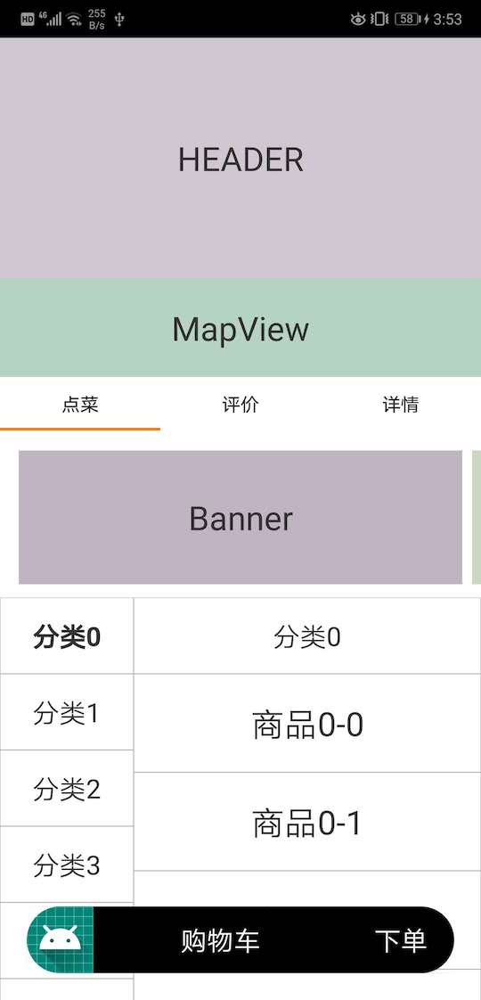

# Demo

## Demo1：嵌套滚动效果演示

界面的初始状态如下（最完整的场景）：



整个界面的View嵌套结构如下：

```
FrameLayout {
    ActionBar,
    ShopCart,
    CoordinatorLayout { // 滚动容器
        FrameLayout { // 头部容器，和屏幕等高
            Header, // 露出来的Header部分
            ScrollView, // 商家活动信息
            Button, // 收起头部的关闭按钮
        }
        NestedScrollView {
            LinearLayout {
                MapView
                LinearLayout { // Tab + ViewPager
                    TabLayout
                    ViewPager [
                        NestedScrollView { // 点菜
                            LinearLayout {
                                RecyclerView (Banner),
                                LinearLayout (Horizontal) {
                                    RecyclerView (CategoryList),
                                    StickyHeaderRecyclerView (GoodsList)
                                }
                            }
                        },
                        RecyclerView, // 评价
                        NestedScrollView // 详情
                    ]
                }
            }
        }
    }
}
```


嵌套滑动效果如gif图所示。

- 包含MapView在内的整个组件可以下拉，购物车隐藏，头部展开，看到商家活动信息。点击关闭按钮头部收起至初始状态。
- 上滑时ActionBar渐变显示。MapView隐藏，TabLayout停靠在ActionBar下方。
- 继续上滑，Banner隐藏，界面中显示最主要的分类列表和商品列表，且两者可以联动操作。
- ViewPager切换到另外两个Tab，隐藏购物车，分别显示评价和详情。同样可以上下滑动。


## Demo2：显示组件边界

测试环境开启显示组件边界功能后，每个Block边界都会被绘制出来，同时会有Label展示Block的类名。

由于Block嵌套层级比较深，为了避免重叠看不清，因此Label可以拖拽，且拖拽时会显示Block布局范围。

显示边界的功能，有利于不熟悉代码的开发者，根据直观的界面快速定位到工程中具体的代码实现。


